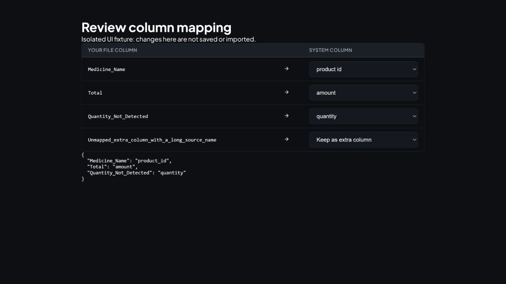

# Module 6.3: Schema mapping and validation

This module gives columns consistent names and values before the chatbot and
reports use them. It runs locally without asking an LLM to guess the schema.

## The sequence

1. Connect a file, Tally source, Shopify resource or SQL database.
2. Read a preview. Exact names, domain synonyms, fuzzy matches and sample values
   produce mapping suggestions. Conflicting suggestions have one winner; other
   columns remain available as extra data.
3. Look for a previously confirmed profile for the same domain and source.
   File identity includes its path and sheet. Network identity includes its
   store/resource, port and company selector but excludes credentials. SQL identity includes a digest of
   its connection string and table. A simple `SELECT * FROM table` preview
   matches that table's profile. Different header casing is adapted safely;
   missing or ambiguous saved headers require another review.
4. For a new source, show the editable mapping table. Every source column is
   available, including columns without a suggestion. Choose a system field or
   keep the column as extra data. Fields already assigned elsewhere are disabled.
   Automatic mode pauses here for a new source.
5. Confirm and save the mapping. The backend rejects nonexistent columns,
   unknown destination fields, duplicate destinations and column collisions
   before writing a profile. Invalid confirmation does not overwrite a profile.
   SQL database imports offer an editable mapping for each selected table; the
   import button explicitly confirms those mappings.
6. Normalize a copy of the data. Valid pharmacy values retain their established
   conversion behavior. Extra columns remain available during ingestion.
   Failed conversions retain their original values, fields and source rows in
   diagnostic metadata instead of disappearing without explanation.
7. Validate the normalized data. The result contains error/warning codes, row
   references, examples, null counts and a usability verdict. Ingestion checks
   validation before replacing existing knowledge-base content.
8. Import usable data. Confirmed mappings can be reused for future imports.
   Existing unscoped profiles are left on disk but are not automatically trusted
   for a different source/domain; the first scoped import requires review.

## E-commerce changes and pharmacy isolation

Only e-commerce uses the new floating Excel-serial-date handling, UTC normalization
and `order_date` conversion. It retains `order_date` and `sale_amount` and exposes
core `date` and `amount` aliases for shared RAG date filters and analytics.
Order-shaped data is validated as transactions even when its dates are missing.
Negative sales and ratings outside 1–5 produce explicit domain warnings instead
of crashing or being silently ignored.

Pharmacy's successful date parser and inventory/transaction classification remain
unchanged. Conversion diagnostics apply to every domain, so an invalid pharmacy
date can now be reported with its original value even if normalization yielded
a missing date.

Pharmacy imports require source evidence such as medicine/generic/prescription/
registration fields or recognized medicinal descriptions. Generic product names,
amounts, prices, batches and expiry dates alone are insufficient. Clearly unrelated
products are rejected before ingestion. Ambiguous standalone files are also
rejected with guidance to use a pharmacy export or choose another domain.

Related sales, customer and supplier tables can be imported from a database with
pharmacy evidence. The full table is checked before ingestion; discovery uses
small previews so a large database is not loaded entirely into memory at once.

This is a conservative schema/content check, not an exhaustive medicine registry
or a proof of the meaning of arbitrary text. Incorrectly labelled or unfamiliar
data still needs human review. Existing indexed data is not retroactively deleted.

## Effect on RAG, reporting and background sync

Canonical field names are preserved. RAG receives consistent product identity,
numbers and date metadata; reporting uses the same valid pharmacy measures.
This improves input quality, without changing the chatbot's model or claiming a
measured generation-speed improvement.

Uploaded Files quick-import sends a new source to the mapping review page before starting ingestion. Previously confirmed sources can continue directly. Dashboard and report loading also reuse confirmed mappings; saving a correction clears the cached schema so the next calculation uses it.

Periodic and live SQL synchronization reuse confirmed corrections. New tables
pause until reviewed; registered legacy tables retain a compatibility fallback.
An invalid live event is rejected independently so other valid events can continue.
Rejected events do not create fake active registry entries. Corrected existing
data needs an explicit re-import or synchronization before stored answers improve.

## Repeatable checks

```powershell
& ./scripts/test-backend.ps1 -TestArgs @(
    'tests/test_schema_confirmation_regressions.py',
    'tests/test_schema_mapping.py',
    'tests/test_schema_mapping_hard.py',
    'tests/test_validation.py',
    'tests/test_validation_hard.py',
    'tests/test_schema_driven_analytics.py',
    'tests/test_rag.py',
    'tests/test_reporting.py',
    'tests/test_ecommerce_reporting.py',
    'tests/test_sql_database_ingest.py',
    '-q', '--tb=short'
)
```

The SQL retrieval test uses a real temporary SQLite database, isolated knowledge
base and row provenance. Most RAG/report narrative tests mock the LLM to make
them repeatable. Dummy HTTP connector tests use real loopback servers.

For the isolated editor fixture, run the frontend development server and open
`/tests/mapping-review.html`. It uses the actual mapping component, including
unmapped-column editing, clearing assignments and duplicate-field prevention,
without calling any import API or modifying user data.



Verification on 3 October 2026: the combined backend suite passed all 568 tests, covering schema mapping, validation, connectors, SQL ingestion, RAG, reporting, KPI calculations and file APIs. TypeScript checking and the Vite production build passed. The actual mapping component was checked interactively through the isolated editor fixture.
