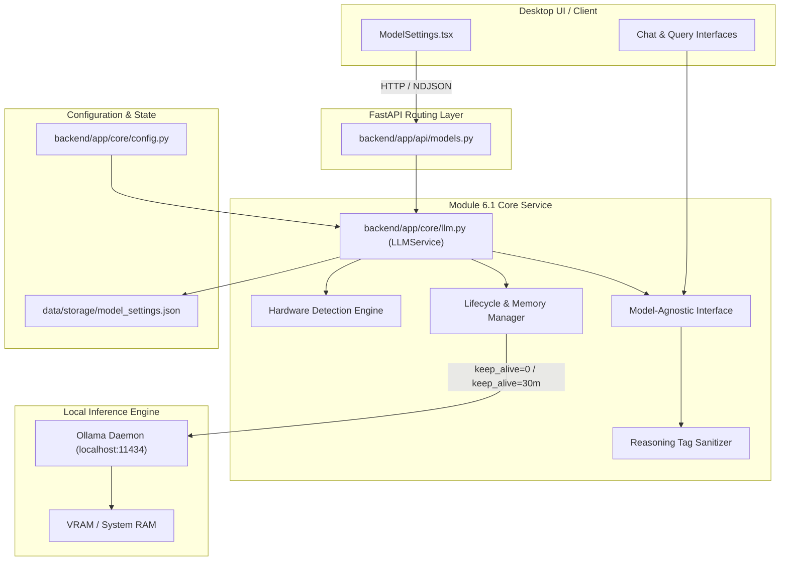

# Module 6.1: Local LLM Inference Module — Architectural Specification & File Identification

## 1. Executive Overview

The **Local LLM Inference Module** (Module 6.1) manages the locally running language model via **Ollama**. It encapsulates hardware capability detection, model downloading/pulling, dynamic memory management (loading and unloading models to/from VRAM and system RAM), model switching, and text inference behind a single internal, model-agnostic interface.

By decoupling the rest of the application (RAG pipelines, KPI engines, query planners, report generators) from specific model names or prompt idiosyncrasies, the system can seamlessly switch between lightweight CPU-optimized models (e.g., `phi4-mini`, `qwen2.5:1.5b`) and high-throughput GPU models (e.g., `qwen2.5:7b`, `mistral:7b`, `llama3.1:8b`).

---

## 2. Identified Files Comprising Module 6.1

| Component / Layer | File Path | Primary Responsibilities |
| :--- | :--- | :--- |
| **Core Service & Logic** | `backend/app/core/llm.py` | • Hardware detection (CPU, CUDA, Metal, Intel/AMD VRAM). • Dynamic profile recommendation (`cpu_lightweight`, `gpu_budget`, `gpu_standard`, `gpu_heavy`). • Model lifecycle (pulling, streaming progress, loading via keep-alive, unloading via keep_alive=0). • Active model switching with file persistence and thread-safe locking. • Model-agnostic inference (`generate`, `chat`, `chat_stream`). • Reasoning tag `<think>` filtering and timing metric telemetry. |
| **REST & Streaming API** | `backend/app/api/models.py` | • FastAPI endpoints for model management (`/api/models/*`). • Hardware inspection endpoint (`/api/models/hardware`). • Active model switching (`/api/models/select`). • VRAM lifecycle controls (`/api/models/load`, `/api/models/unload`). • Real-time model pulling with NDJSON streaming (`/api/models/pull`). • Model inspection (`/api/models/running`, `/api/models/info/{name}`). |
| **Configuration Settings** | `backend/app/core/config.py` | • Ollama server host (`ollama_host`). • Default model identifier (`llm_model`). • Keep-alive policies (`llm_keep_alive`, `llm_keep_alive_chat`). • Hyperparameters (`llm_temperature`, `llm_num_predict`). |
| **Desktop User Interface** | `desktop/src/components/settings/ModelSettings.tsx` | • React/TypeScript UI for model selection, pulling with progress bar, VRAM/GPU overview, and manual pre-warm / eviction controls. |
| **Application Wiring** | `backend/app/main.py` | • Registers and mounts the `models.router` under `/api/models`. |

---

## 3. Architecture & Data Flow

---

## 4. Hardware Detection & Recommendation Matrix

The module inspects system resources upon startup or on-demand:

| Hardware Tier | Detection Criteria | Recommended Profile | Recommended Model Family |
| :--- | :--- | :--- | :--- |
| **CPU Only** | `gpu_available == False` | `cpu_lightweight` | `phi4-mini`, `phi3:mini`, `llama3.2:3b`, `qwen2.5:3b`, `qwen2.5:1.5b` |
| **Budget GPU** | VRAM < 5.5 GB | `gpu_budget` | `qwen2.5:3b`, `phi4-mini`, `llama3.2:3b`, `gemma2:2b` |
| **Standard GPU**| 5.5 GB ≤ VRAM < 12 GB | `gpu_standard` | `qwen2.5:7b`, `mistral:7b`, `llama3.1:8b`, `phi4-mini` |
| **Heavy GPU**   | VRAM ≥ 12 GB | `gpu_heavy` | `qwen2.5:14b`, `qwen2.5:7b`, `mistral:7b`, `llama3.1:8b` |
| **Apple Metal** | macOS MPS available | `cpu_lightweight` / small tier | `phi4-mini`, `llama3.2:3b`, `qwen2.5:3b` |

---

## 5. Model Lifecycle & Memory Management

1. **Pulling**:
   - `pull_model(model_name)`: Non-blocking synchronous pull.
   - `pull_model_stream(model_name)`: Yields parsed NDJSON chunks with completed bytes, total bytes, and calculated progress percentages.
2. **Pre-warming (Load)**:
   - `load_model(model_name, keep_alive="30m")`: Issues a zero-token request to Ollama with the requested `keep_alive` duration. Keeps the model resident in VRAM for zero-latency subsequent queries.
3. **Eviction (Unload)**:
   - `unload_model(model_name)`: Issues a zero-token request to Ollama with `keep_alive=0`, immediately freeing VRAM and RAM for other intensive tasks.
4. **VRAM Footprint Monitoring**:
   - `get_running_models()`: Queries `client.ps()` to report active models, VRAM bytes, VRAM MB, and expiration timestamps.

---

## 6. Model-Agnostic Interface Specification

Regardless of which model is active:
- **`generate(prompt, system_prompt, keep_alive, options, model)`**: Returns clean, model-agnostic text output.
- **`chat(messages, keep_alive, options, model)`**: Multi-turn dialogue execution.
- **`chat_stream(messages, keep_alive, options, model)`**: Yields streamed tokens, with active buffering to remove `<think>...</think>` tags on the fly without introducing latency.
- **Language Policy Resolution**: Queries in Roman Urdu or Urdu script automatically route to fine-tuned bilingual models (e.g., `llama3.2:3b`) when available, while defaulting cleanly to the active model.
