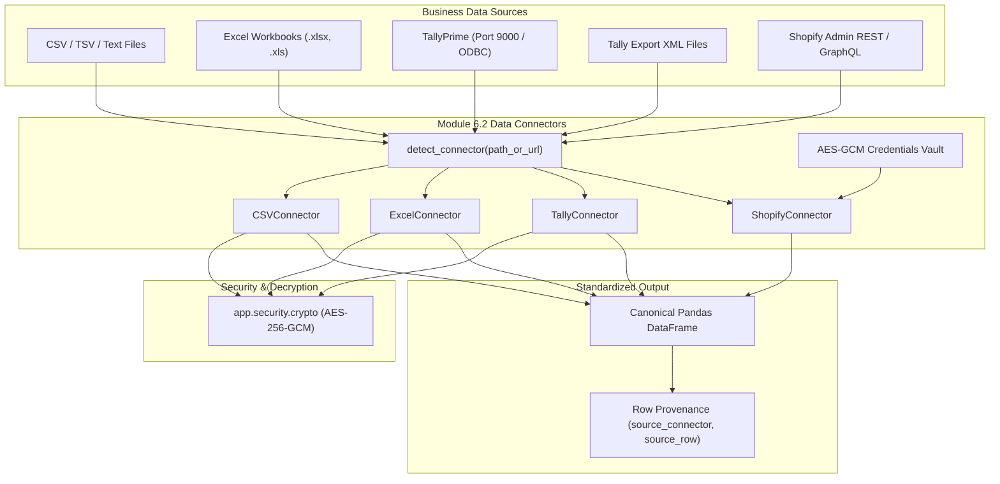

# Module 6.2: Data Connector Module — Architectural Specification & File Identification

## 1. Executive Overview

The **Data Connector Module** (Module 6.2) is the ingestion gateway of **LLM-Konnect**. It is responsible for pulling financial, transactional, inventory, and operational data from heterogeneous business sources and converting them into a standardized, canonical format for downstream schema mapping (Module 6.3), validation, RAG knowledge bases (Module 6.4 & 6.5), and analytics/KPI engines (Module 6.6).

The connector suite provides three core extraction vectors:
1. **CSV/Excel Universal Baseline**: Offline-first, resilient tabular extractor with automatic encoding detection, delimiter sniffing, header boundary inference, and encrypted-at-rest support.
2. **Tally Prime Direct Local Extraction**: Dual-mode extraction via live HTTP/XML endpoint (TDL export envelope to port 9000) or Tally ODBC collection queries, with full support for inventory vouchers, batches, and expiries.
3. **Shopify Admin API E-Commerce Extraction**: REST and GraphQL client supporting store access tokens, Link header pagination, rate-limit retry-after backoff, and granular extraction of orders, line-item refunds, products, variants, and customer review metaobjects.

---

## 2. Identified Files Comprising Module 6.2

| Component / Layer | Source File Path | Primary Responsibilities |
| :--- | :--- | :--- |
| **Abstract Connector Base** | `backend/app/connectors/base.py` | • Abstract Base Class `Connector` (`fetch`, `preview`, `describe`, `capabilities`, `total_rows`). • Dynamic router `detect_connector(path_or_url)` mapping file extensions and URL schemes. • Source verification utilities (`source_exists`, `is_network_or_custom_source`). |
| **CSV & Excel Connector** | `backend/app/connectors/csv_excel.py` | • Universal baseline for file imports. • `_sniff_csv_format_from_bytes`: Auto-detects encoding (UTF-8, Latin-1, etc.), delimiter (`,`, `;`, `\t`, `\|`), and skip-row header index. • `CSVConnector`: In-memory decryption, malformed row recovery for trailing text fields, row metadata (`source_connector`, `source_row`). • `ExcelConnector`: Multi-sheet discovery (`list_sheets`), header heuristic, streaming `BytesIO`. |
| **Tally Prime & Local DB Connector** | `backend/app/connectors/tally.py` | • `parse_tally_xml`: XML parser extracting Sales, Purchases, Receipts, Payments, inventory items, batch numbers, and expiry dates. • `TallyConnector`: Live HTTP client sending TDL export envelopes to Tally server (port 9000) and ODBC DSN collection query engine. • `LocalDBConnector`: Direct extraction from SQLite (`.sqlite`, `.db`) and MS Access (`.mdb`, `.accdb`). |
| **Shopify Admin API Connector** | `backend/app/connectors/shopify.py` | • Multi-resource e-commerce extraction (`orders`, `products`, `reviews`, `customers`). • Secure authentication via `X-Shopify-Access-Token`. • Rate-limit handling (HTTP 429 `Retry-After` header and GraphQL `THROTTLED` exponential backoff). • Order line-item flattening with refund and shipping allocations. • Product inventory and GraphQL unit cost retrieval (`_inventory_costs`). • Review metaobject GraphQL extractor (`_fetch_reviews`). |
| **Encrypted Credential Vault** | `backend/app/connectors/credentials.py` | • AES-GCM encrypted persistence of Shopify access tokens (`save_shopify_token`, `read_shopify_token`). • Prevents token leakage into URLs, log files, or source signatures. |
| **Auxiliary Connectors** | `backend/app/connectors/sql.py` `backend/app/connectors/json.py` `backend/app/connectors/watcher.py` | • Enterprise relational databases (PostgreSQL, MSSQL, MySQL, Oracle). • Flat JSON/JSONL reader. • Continuous directory file watcher for automated ingestion. |
| **API Endpoints Layer** | `backend/app/api/files.py` `backend/app/api/routes.py` `backend/app/api/kb.py` | • API endpoints exposing file upload, preview (`/api/preview`), sheet listing (`/api/sheets`), and ingestion triggering. |

---

## 3. Data Extraction Architecture

---

## 4. Key Behavioral Contracts

1. **Deterministic Row Provenance**:
   - Every connector injects `source_connector` (e.g., `'csv'`, `'excel'`, `'tally'`, `'shopify'`) and `source_row` (1-indexed physical or virtual line identifier) to enable row-level audit trails and provenance in KPI analytics.
2. **Encrypted At Rest Transparency**:
   - Encrypted files (`.enc`) are transparently decrypted in memory via `decrypt_file_to_bytes()`, ensuring unencrypted data is never written to disk during extraction.
3. **Resilient Delimiter & Encoding Sniffing**:
   - Sniffs character encodings and delimiting characters automatically to accept messy POS exports without manual configuration.
4. **Rate Limit Resilience**:
   - Shopify connector respects HTTP 429 `Retry-After` headers and applies exponential backoff for throttled GraphQL requests, preventing API lockouts during bulk syncs.
