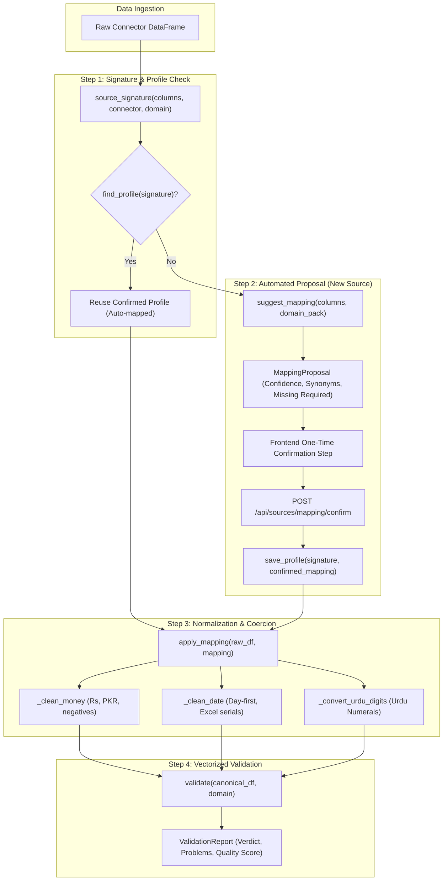

# Module 6.3: Schema Mapping and Validation Module — Architectural Specification & File Identification

## 1. Executive Overview

The **Schema Mapping and Validation Module** (Module 6.3) normalizes disparate, messy, and inconsistent column names, date representations, and currency formats across heterogeneous business sources (POS exports, Tally registers, Shopify APIs) into one unified, internal standard schema.

To guarantee 100% data fidelity without hallucination, the module adopts a **pharmacy-first, deterministic, offline design**:
1. **Automated Header Mapping**: Generates initial schema proposals using exact matching, comprehensive domain synonym lookups (e.g. "Medicine Name" → `product_id`, "Bill No" → `invoice_id`), and string normalization without external LLM latency.
2. **One-Time Confirmation Step**: When a new source signature is encountered, the user reviews and confirms or adjusts the proposed mapping. This mapping is saved into an isolated profile on disk (`mapping_profiles/<signature>.json`). Subsequent imports of the same source signature automatically reuse the confirmed profile with zero manual intervention.
3. **Robust Coercion & Normalization Engine**: Cleans monetary strings (`Rs. 1,500/-`, `(250)` → `-250`), parses ambiguous dates (Pakistani `DD/MM/YYYY`, ISO, Excel serials), and converts Eastern Urdu numerals (`۰۱۲۳۴۵۶۷۸۹` → `0123456789`).
4. **Data Quality & Validation Engine**: Runs vectorized domain-agnostic core validation rules (`EMPTY_ROW`, `UNPARSEABLE_DATE`, `UNPARSEABLE_NUMBER`, `NEGATIVE_QUANTITY`) and domain pack extensions, calculating row error references, table statistics, and quality scores.

---

## 2. Identified Files Comprising Module 6.3

| Component / Layer | Source File Path | Primary Responsibilities |
| :--- | :--- | :--- |
| **Canonical Models & Core Fields** | `backend/app/schema/canonical.py` | • Defines domain-agnostic `CORE_FIELDS` (`date`, `description`, `category`, `quantity`, `unit_price`, `amount`, `cost`, `tax`, `discount`, `invoice_id`, `product_id`, `customer_id`, `supplier_id`, `txn_type`, `payment_method`). • Core traceability columns (`source_connector`, `source_row`). • Vectorized core rule evaluation (`validate_core_dataframe`). |
| **Header Mapping Engine** | `backend/app/schema/mapper.py` | • `suggest_mapping()`: Full proposal generation pipeline producing serializable `MappingProposal`. • `_normalize_header_string()`: Strips punctuation, handles camelCase/snake_case, preserves Urdu unicode. • `_build_synonym_lookup()`: Inverts domain pack synonym trees into fast exact lookup tables. • Identifies missing required canonical fields. |
| **Data Coercion & Normalizer** | `backend/app/schema/normalize.py` | • `apply_mapping()`: Renames columns and applies vectorized type coercion. • `_clean_money()`: Currency cleaning, parentheses negation, comma removal, Urdu digit translation. • `_clean_date()`: Day-first parsing, Excel serial timestamps, Urdu numeral dates. • `_convert_urdu_digits()`: Maps Urdu numerals to ASCII digits. • Preserves unmapped source columns under `_extra.` prefix when requested. |
| **Validation & Quality Engine** | `backend/app/schema/validate.py` | • `validate()`: Vectorized data quality audit evaluating core and domain-pack rules. • Emits structured `ValidationReport` with `Problem` objects containing row references, counts, and samples. • `clean()`: Automated remediation of empty rows and missing optional values, generating `CleaningSummary`. |
| **Profile & Signature Persistence** | `backend/app/schema/profile.py` | • `source_signature()`: Deterministic MD5 hash of source column headers, connector type, and domain. • `save_profile()`: Atomic file persistence of user-confirmed mapping profiles. • `find_profile()` & `list_profiles()`: Instant profile lookup enabling the one-time confirmation pattern. |
| **Domain Pack Registry & Packs** | `backend/app/schema/domain.py` `backend/app/schema/pharmacy.py` `backend/app/schema/ecommerce.py` `backend/app/schema/finance.py` | • Domain abstraction layer providing domain-specific extra fields (`batch_no`, `expiry_date`, `salt_composition`, `dosage_form`), header synonyms, and custom business validation rules. |
| **API Confirmation Routes** | `backend/app/api/routes.py` | • `POST /api/sources/preview`: Generates mapping proposal and checks for existing saved profiles. • `POST /api/sources/mapping/confirm`: Receives user-confirmed mapping, validates, normalizes, saves profile, and returns canonical data preview. |

---

## 3. Schema Normalization Architecture & One-Time Confirmation Flow

---

## 4. Key Behavioral Standards

1. **Deterministic Execution**:
   - Zero non-deterministic LLM hallucinations during schema mapping. Same source columns always yield the exact same proposal.
2. **One-Time Confirmation Guarantee**:
   - Once a user confirms a mapping for a source, subsequent imports matching the column signature bypass manual review and automatically ingest.
3. **Traceability Preservation**:
   - Preserves `source_connector` and `source_row` so downstream KPI and anomaly engines can trace every number back to its raw physical spreadsheet row.
4. **Encoding & Regional Localization**:
   - Full support for Pakistani accounting conventions (e.g. `Rs. 450/-`, `(1,200)`, day-first `15/01/2026`, and Urdu numerals `۱۲۵۰`).
